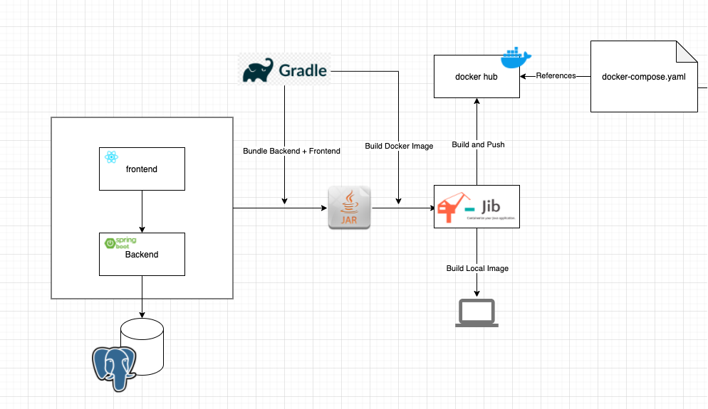

# Project Name
> Full Stack Application using Spring Boot | React | Gradle | Docker | AWS and CICD with Github Actions

## Table of contents
* [General info](#general-info)
* [Screenshots](#screenshots)
* [Technologies](#technologies)
* [Setup](#setup)
* [Features](#features)
* [Status](#status)
* [Inspiration](#inspiration)
* [Contact](#contact)

## General info
Full Stack Training Exercise to learn new concepts

## Screenshots

## Concepts
* Spring Boot Backend API
* Frontend with React.js Hooks and Functions Components
* Gradle Build Tool
* Databases using Postgres on Docker
* Spring Data JPA
* Server and Client Side Error Handling
* Packaging applications for deployment using Docker and Jib
* AWS RDS & Elastic Beanstalk
* Unit

To-do list:
* Software Deployment Automation with Github Actions
* Software Deployment Monitoring with Slack
* Integration Testing

## Setup
More coming

## Status
Project is: _in progress_
On hold while focusing on another passion project to further deepen those concepts.

## Contact
Created by [@browniebytes](https://www.todo) - feel free to contact me!
